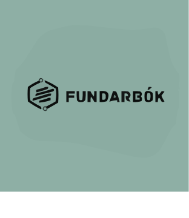

<div align="center">
  

  # Fundarbok.fo

  Parliamentary document management and tracking system for committee meetings and agenda items.
</div>

## Project Status & Roadmap

This project is actively under development with a phased implementation approach. Track progress and contribute via [GitHub Issues](https://github.com/jhoj/fundarbok.fo/issues).

### Current Work (MVP Release)

| Phase | Task | Priority | Status | Link |
|-------|------|----------|--------|------|
| 9 | Backend Push Notification Triggers | High | To Do | [#1](https://github.com/jhoj/fundarbok.fo/issues/1) |
| 23 | Styling & Theming | High | To Do | [#3](https://github.com/jhoj/fundarbok.fo/issues/3) |
| 24 | Testing | High | To Do | [#4](https://github.com/jhoj/fundarbok.fo/issues/4) |

### Upcoming Work (Post-MVP)

| Phase | Task | Priority | Status | Link |
|-------|------|----------|--------|------|
| 18 | Frontend - Create Document/Report (STOVNA SKRÁ) | Medium | Blocked | [#2](https://github.com/jhoj/fundarbok.fo/issues/2) |

## Technology Stack

- **Frontend**: Angular
- **Backend**: .NET Core / C#
- **Database**: PostgreSQL
- **PWA**: Firebase Cloud Messaging (FCM)
- **Deployment**: Docker, CI/CD

## Getting Started

### Prerequisites
- Node.js (for frontend)
- .NET 6+ (for backend)
- PostgreSQL
- Docker (optional)

### Development Setup

```bash
# Backend
cd backend
dotnet build
dotnet run

# Frontend
cd frontend
npm install
npm start
```

## Test Credentials

Available in completed phases and CI/CD configuration.

## Contributing

See [GitHub Issues](https://github.com/jhoj/fundarbok.fo/issues) for open work.

For completed milestones, see `completed-todos.md`.

## License

TBD
